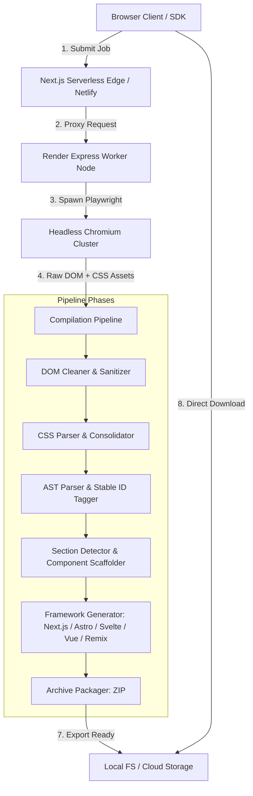

# System Design Architecture

SiteCompiler is an automated website compiler and code generator engineered to crawl, sanitize, and deconstruct production web pages into idiomatic source code across modern frontend frameworks (Next.js 15, Astro 4, SvelteKit 2, Vue 3/Nuxt 3, and Remix).

## Architectural Highlights

1. **Dual-Tier Deployment Strategy**:
   - **Frontend & Edge Tier (Netlify/Vercel)**: Serves static assets, user authentication, and lightweight proxies.
   - **Heavy Worker Tier (Render Docker instance)**: Houses the headless Chromium runtime and memory-intensive compilation tasks.

2. **Idempotency & Resilience**:
   - Every compilation request accepts an `x-idempotency-key` header to prevent duplicate crawler runs.
   - Watchdog timers enforce strict timeouts across individual stages, with automatic fallbacks (e.g. raw HTML fallback if AST parsing fails).

3. **Multi-Target Code Generation Engine**:
   - Compiles parsed DOM representations into framework-specific idioms:
     - **Next.js**: React Server Components + Client hydration boundaries.
     - **Astro**: Static `.astro` component layouts and zero-JS hydration islands.
     - **SvelteKit**: Single-file reactive components (`.svelte`).
     - **Vue / Nuxt**: Composition API templates (`.vue`) and Pinia stores.
     - **Remix**: Route modules with meta functions and loaders.
